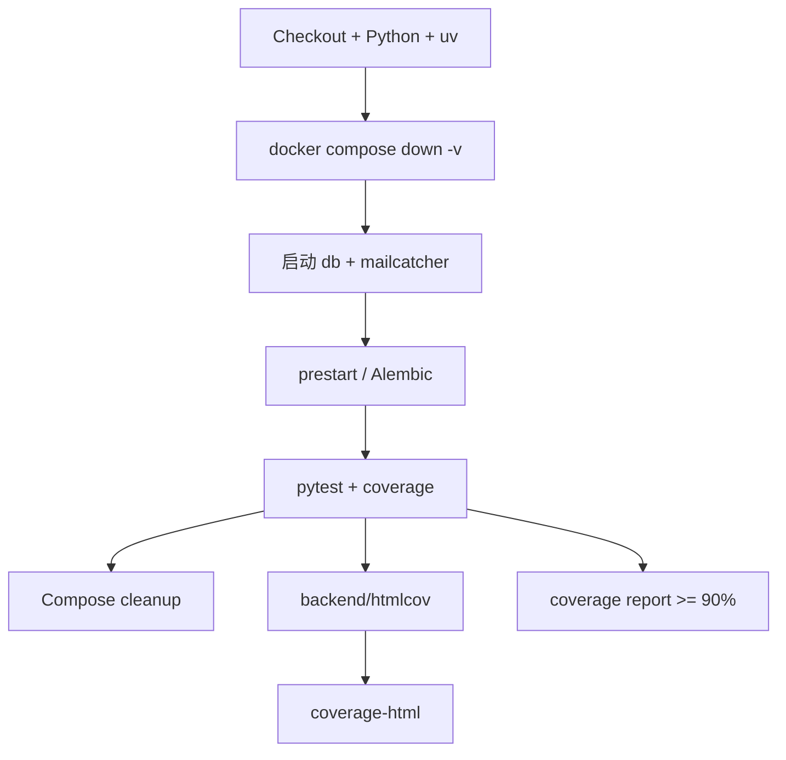

<Callout type="idea" title="工作流定位">

这不是纯单元测试：测试进程在 Runner 上运行，但依赖真实 PostgreSQL 与邮件捕获服务，覆盖数据库迁移、API、CRUD 和邮件链路。

</Callout>

## 这个工作流解决什么问题

- 在 PR 和默认分支验证后端行为。
- 每次从干净数据卷开始，避免状态污染。
- 在测试前验证 Alembic 迁移可执行。
- 生成 HTML coverage 供后续发布。
- 把最低覆盖率固定为 90%。

## 触发器与权限

<Tabs items={['触发条件', '权限与 Secrets']}>
  <Tab>

| 配置 | 含义 |
| --- | --- |
| `push.master` | 合并后回归。 |
| `pull_request` | 提交进入默认分支前验证。 |

  </Tab>
  <Tab>

| 权限或密钥 | 用途 |
| --- | --- |
| `contents: read` | 检出源码。 |
| `Actions artifact` | 上传 coverage-html；无需额外仓库写权限。 |

  </Tab>
</Tabs>

## 执行流程

<Steps>
  <Step>

### 1. 检出代码并准备 Python、uv。

  </Step>
  <Step>

### 2. 清理 Compose 残留与数据卷。

  </Step>
  <Step>

### 3. 启动 db 和 mailcatcher。

  </Step>
  <Step>

### 4. 运行 prestart，等待数据库并执行迁移。

  </Step>
  <Step>

### 5. 运行 tests-start 生成 coverage。

  </Step>
  <Step>

### 6. 停止并清理依赖容器。

  </Step>
  <Step>

### 7. 上传 HTML 报告并执行 90% 阈值检查。

  </Step>
</Steps>



## 设计思路

- 基础设施依赖容器化，测试代码本地运行，兼顾真实性与调试速度。
- 迁移步骤独立显示，数据库 schema 失败时更容易定位。
- HTML artifact 与命令行阈值承担不同职责：前者用于阅读，后者用于门禁。
- 测试脚本复用 backend/scripts，减少 CI 与本地命令差异。

## 与其他模块的关系

| 模块 | 关系 |
| --- | --- |
| `backend/scripts/prestart.sh` | 等待数据库并运行迁移。 |
| `backend/scripts/tests-start.sh` | 封装测试与 coverage 命令。 |
| `backend/tests` | API、CRUD、脚本与工具测试。 |
| `smokeshow.yml` | 消费 coverage-html artifact。 |


## 带注释源码

> 原始路径：`.github/workflows/test-backend.yml`。以下仅增加学习性注释，不改变触发器、权限、表达式或命令行为。

```yaml title="test-backend.yml" lineNumbers
name: Test Backend

# 默认分支和 PR 都运行后端集成测试。
on:
  push:
    branches:
      - master
  pull_request:
# 只需读取源码和上传普通 artifact。
permissions:
  contents: read

jobs:
  test-backend:
    runs-on: ubuntu-latest
    timeout-minutes: 5
    steps:
      - name: Checkout
        uses: actions/checkout@3d3c42e5aac5ba805825da76410c181273ba90b1 # v7.0.1
        with:
          persist-credentials: false
      - name: Set up Python
        uses: actions/setup-python@5fda3b95a4ea91299a34e894583c3862153e4b97 # v7.0.0
        with:
          python-version-file: .python-version
      - name: Install uv
        uses: astral-sh/setup-uv@c771a70e6277c0a99b617c7a806ffedaca235ff9 # v9.0.0
        with:
          # Before upgrading uv version, make sure astral-sh/setup-uv knows its checksum.
          # See: https://github.com/astral-sh/setup-uv/issues/851#issuecomment-4282017837
          version: "0.11.18"
      # 先清除残留容器、网络和数据卷，保证数据库状态干净。
      - run: docker compose down -v --remove-orphans
      # 测试只启动外部依赖；Python 应用直接在 Runner 环境执行。
      - run: docker compose up -d db mailcatcher
      # prestart 等待数据库并执行 Alembic 迁移。
      - name: Migrate DB
        run: uv run bash scripts/prestart.sh
        working-directory: backend
      # tests-start 运行 pytest/coverage，并带入当前 commit 描述。
      - name: Run tests
        run: uv run bash scripts/tests-start.sh "Coverage for ${{ github.sha }}"
        working-directory: backend
      - run: docker compose down -v --remove-orphans
      # HTML 报告供后续 Smokeshow workflow_run 下载。
      - name: Store coverage files
        uses: actions/upload-artifact@043fb46d1a93c77aae656e7c1c64a875d1fc6a0a # v7.0.1
        with:
          name: coverage-html
          path: backend/htmlcov
          include-hidden-files: true
      # 再次从数据文件输出摘要，并强制总覆盖率不低于 90%。
      - name: Coverage report
        run: uv run coverage report --fail-under=90
        working-directory: backend
```

## 阅读重点

- `docker compose down -v` 会删除测试卷，保证数据库干净。
- `working-directory: backend` 决定脚本和 Python 项目解析位置。
- upload-artifact 发生在覆盖率阈值检查之前，便于失败时仍保留报告。
- Smokeshow 依赖 artifact 名称 `coverage-html`。

<Callout type="warn" title="维护与安全边界">

- 若测试在 cleanup 前失败，当前显式清理步骤可能被跳过；GitHub 托管 Runner 会销毁，但本地复用 Runner 时应考虑 `if: always()`。
- 测试数据库凭据必须是专用测试值。
- 覆盖率阈值不应诱导无意义测试，仍要优先覆盖关键行为和边界。

</Callout>
