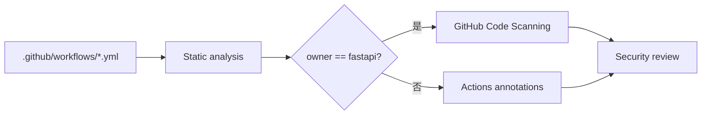

<Callout type="warn" title="工作流定位">

这是“检查 CI 本身”的安全门禁。普通测试关注应用代码，Zizmor 则把 `.github/workflows` 当成高权限程序进行静态分析。

</Callout>

## 这个工作流解决什么问题

- 发现危险触发器与不可信代码执行组合。
- 检查过宽 permissions 和 Secret 使用。
- 检查第三方 Action 是否固定到安全版本。
- 官方仓库上传 SARIF，派生仓库使用 PR 注解。

## 触发器与权限

<Tabs items={['触发条件', '权限与 Secrets']}>
  <Tab>

| 配置 | 含义 |
| --- | --- |
| `push.master` | 默认分支持续扫描。 |
| `pull_request` | 工作流变更合并前扫描。 |
| `workflow_dispatch` | 维护者手动复查。 |

  </Tab>
  <Tab>

| 权限或密钥 | 用途 |
| --- | --- |
| `actions: read` | 读取 Actions 元数据。 |
| `contents: read` | 读取工作流源码。 |
| `security-events: write` | 上传 SARIF 到 Code Scanning。 |
| `permissions: {}` | 其他 Job/默认令牌无额外权限。 |

  </Tab>
</Tabs>

## 执行流程

<Steps>
  <Step>

### 1. 检出仓库且不保留 Git 凭据。

  </Step>
  <Step>

### 2. Zizmor 解析所有 GitHub Actions YAML。

  </Step>
  <Step>

### 3. 识别触发器、权限、注入、固定版本等风险。

  </Step>
  <Step>

### 4. FastAPI 官方仓库把结果上传 Advanced Security。

  </Step>
  <Step>

### 5. 派生仓库把发现显示为普通 Actions 注解。

  </Step>
</Steps>



## 设计思路

- 扫描器 Action 自身固定到完整 commit。
- 根据仓库 owner 自适应 Advanced Security 是否可用。
- Job 级权限只覆盖读取源码和写安全事件。
- zizmor ignore 注释应是经过解释的例外，而不是静默关闭规则。

## 与其他模块的关系

| 模块 | 关系 |
| --- | --- |
| `所有 workflows` | Zizmor 的扫描输入。 |
| `pull_request_target workflows` | 需要重点审查是否执行不可信代码。 |
| `GitHub Code Scanning` | 展示 SARIF 结果与历史。 |
| `Dependabot` | 帮助更新固定 SHA 的 Action 版本。 |


## 带注释源码

> 原始路径：`.github/workflows/zizmor.yml`。以下仅增加学习性注释，不改变触发器、权限、表达式或命令行为。

```yaml title="zizmor.yml" lineNumbers
name: Zizmor

# 工作流文件变化可在 PR、默认分支和手动运行中扫描。
on:
  push:
    branches:
      - master
  pull_request:
  workflow_dispatch:

# 顶层无权限；扫描 Job 只申请读取与上传安全结果。
permissions: {}

jobs:
  zizmor:
    # Zizmor 专门分析 GitHub Actions 的权限、触发器和供应链风险。
    name: Run zizmor
    runs-on: ubuntu-latest
    timeout-minutes: 5
    permissions:
      actions: read
      contents: read
      # 官方仓库启用 Code Scanning 时，需要写入 SARIF。
      security-events: write # Required for upload-sarif (used by zizmor-action) to upload SARIF files.
    steps:
      - name: Checkout repository
        uses: actions/checkout@3d3c42e5aac5ba805825da76410c181273ba90b1 # v7.0.1
        with:
          persist-credentials: false
      # 官方仓库上传 Advanced Security；模板派生仓库回退为普通注解。
      - name: Run zizmor
        uses: zizmorcore/zizmor-action@6fc4b006235f201fdab3722e17240ab420d580e5 # v0.6.1
        with:
          advanced-security: ${{ github.repository_owner == 'fastapi' }}
          annotations: ${{ github.repository_owner != 'fastapi' }}
```

## 阅读重点

- `advanced-security` 与 `annotations` 条件互补。
- SARIF 是安全工具向 GitHub Code Scanning 提交结果的标准格式。
- 工作流安全重点包括高权限事件、脚本注入、未固定 Action 和凭据持久化。

<Callout type="warn" title="维护与安全边界">

- 不要为了让扫描通过而大范围添加 ignore；每个例外都应说明安全依据。
- security-events: write 是敏感权限，只授予扫描 Job。
- Action SHA 固定后仍需通过 Dependabot或人工流程更新安全修复。

</Callout>
