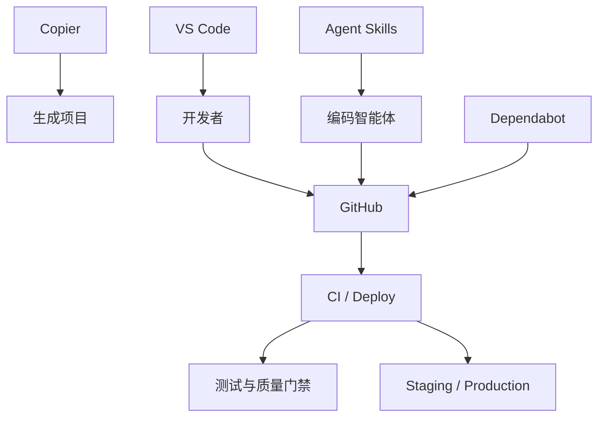

<Callout type="idea" title="目录定位">

tooling 不参与应用运行时请求，但决定项目如何生成、开发、测试、升级和部署。学习成熟项目时，这一层与业务代码同样重要。

</Callout>

## 目录结构

<Files>
  <Folder name="tooling" defaultOpen>
    <Folder name="agent-skills">
      <File name="Library Skills metadata + SKILL.md" />
    </Folder>
    <Folder name="copier">
      <File name="answers template" />
      <File name="update_dotenv.py" />
    </Folder>
    <Folder name="github">
      <File name="Dependabot + labeler" />
      <Folder name="workflows" />
    </Folder>
    <Folder name="vscode">
      <File name="extensions.json" />
      <File name="launch.json" />
    </Folder>
  </Folder>
</Files>

## 如何组织

## 组织原则

- 运行时代码与维护工具分层，避免应用依赖仓库自动化。
- 本地命令和 CI 尽量复用相同脚本。
- 生成工具保留答案与可更新性。
- 编辑器配置只提供推荐，不锁死个人环境。
- 自动化权限和秘密按环境隔离。

## 推荐阅读顺序

<Steps>
  <Step>

### 1. 从 VS Code 配置了解推荐开发工具。

  </Step>
  <Step>

### 2. 阅读 Copier，理解项目如何生成和更新。

  </Step>
  <Step>

### 3. 阅读 GitHub 根配置与 workflows，理解持续维护。

  </Step>
  <Step>

### 4. 阅读 Agent Skills，理解智能体如何获取项目操作知识。

  </Step>
</Steps>
