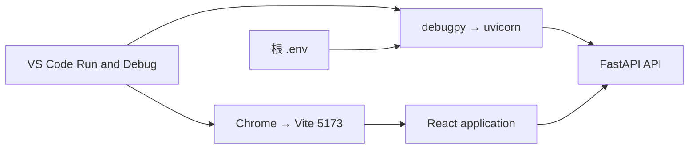

<Callout type="idea" title="目录定位">

`.vscode` 把团队推荐工具和可直接启动的调试场景放进仓库。它提高新成员上手速度，但不会强制安装，也不替代项目命令和 CI。

</Callout>

## 文件结构

<Files>
  <Folder name=".vscode" defaultOpen>
    <File name="extensions.json" />
    <File name="launch.json" />
  </Folder>
</Files>

## 推荐扩展分组

| 分组 | 扩展 | 用途 |
| --- | --- | --- |
| FastAPI/Python | FastAPI, Python, Ruff, ty | 路由、调试、lint、类型检查 |
| 前端 | Biome, Tailwind CSS | 格式化、静态检查和类名补全 |
| 基础设施 | Docker, GitHub Actions | 容器与工作流编辑 |
| 测试 | Playwright | 用例运行、录制和调试 |
| 邮件模板 | MJML | 邮件标记补全与预览 |
| 配置 | Tombi | TOML 格式与校验 |

```json title="extensions.json" lineNumbers
{
    "recommendations": [
        "FastAPILabs.fastapi-vscode",
        "astral-sh.ty",
        "biomejs.biome",
        "bradlc.vscode-tailwindcss",
        "charliermarsh.ruff",
        "docker.docker",
        "github.vscode-github-actions",
        "mjmlio.vscode-mjml",
        "ms-playwright.playwright",
        "ms-python.python",
        "tombi-toml.tombi"
    ]
}
```

## 调试配置

<Tabs items={['FastAPI 后端', 'Vite 前端']}>
  <Tab>

- 调试类型：`debugpy`
- 启动模块：`uvicorn`
- 工作目录：`backend`
- 应用入口：`app.main:app`
- 开启 `--reload`
- 从根 `.env` 注入环境变量
- 启用 Jinja 模板调试

</Tab>
<Tab>

- 调试类型：Chrome
- 打开 `http://localhost:5173`
- 源码根映射到 `frontend`
- 适用于断点、Source Map 与浏览器运行时检查

</Tab>
</Tabs>

```jsonc title="launch.json" lineNumbers
{
    // Use IntelliSense to learn about possible attributes.
    // Hover to view descriptions of existing attributes.
    // For more information, visit: https://go.microsoft.com/fwlink/?linkid=830387
    "version": "0.2.0",
    "configurations": [
        {
            "name": "Debug FastAPI Project backend: Python Debugger",
            "type": "debugpy",
            "request": "launch",
            "module": "uvicorn",
            "args": [
                "app.main:app",
                "--reload"
            ],
            "cwd": "${workspaceFolder}/backend",
            "jinja": true,
            "envFile": "${workspaceFolder}/.env",
        },
        {
            "type": "chrome",
            "request": "launch",
            "name": "Debug Frontend: Launch Chrome against http://localhost:5173",
            "url": "http://localhost:5173",
            "webRoot": "${workspaceFolder}/frontend"
        },
    ]
}
```

## 调试链路



## 阅读重点

- 后端配置使用 `module: uvicorn`，等价于在 Python 环境中启动模块，而不是硬编码可执行文件路径。
- `cwd` 必须是 backend，否则 `app.main:app` 的模块解析和相对路径可能失败。
- `envFile` 指向仓库根 `.env`，与 Docker 和测试配置保持同一来源。
- 前端调试假设开发服务器已在 5173 端口运行；launch 配置本身不会启动 Bun/Vite。
- extensions.json 是推荐列表，团队仍应通过 lockfile、脚本和 CI 固化真正的工具版本。
